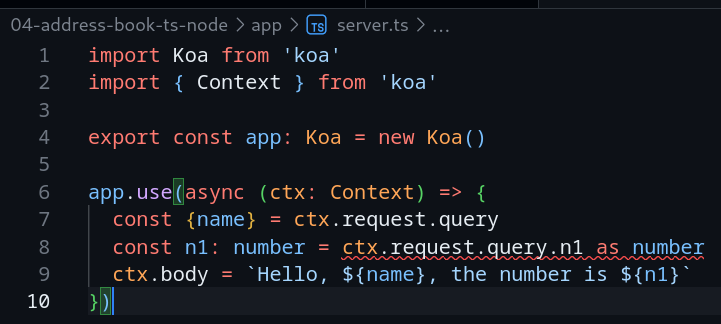

# Address book service - static type checking

This example intends to use static type checking on top of everything else
already seen so far about validation.

## Dependencies

- [node][node] 20.14
- [typescript][typescript] 5.5
- [ts-node][ts-node] 10.9
- [tsx][tsx] 4.16 (fallback, facing issues with ts-node)
- [koa][koa] 2.15
- [koa-jwt][koa-jwt] 4.0
- [@koa/cors][koa-cors] 5.0
- [@koa/router][koa-router] 12.0
- [koa-bodyparser][koa-bodyparser] 4.4
- [koa-api-builder][koa-api-builder] 0.2
- [@electric-sql/pglite][pglite] 0.1
- [cross-env][cross-env] 7.0
- [dotenv-flow][dotenv-flow] 4.1
- [signale][signale] 1.4

## Development dependencies

- [nodemon][nodemon] 3.1
- [xo][xo] 0.58
- [ava][ava] 6.1
- [c8][c8] 10.1
- [supertest][supertest] 7.0

## Types dependencies

There is also some [types][ts-types] added; they are not really required,
however the [Developer Experience][dx] is greatly improved by them.

## Provisioning

```bash
npm init -y
npm i typescript ts-node tsx cross-env dotenv-flow
npm i @electric-sql/pglite signale
npm i koa @koa/cors @koa/router koa-api-builder koa-bodyparser koa-jwt
npm i @types/koa @types/koa-bodyparser @types/koa-cors @types/koa-jwt @types/koa-router @types/signale
npm i -D ava c8 nodemon supertest xo
npm i -D @types/supertest
npx tsc --init
touch index.ts .env .env.development .env.test
mkdir -p app/{configs/migrations,controllers,models,services}
touch app/{server.ts,app.spec.ts}
touch app/configs/{cross-origin.ts,database.ts,logging.ts,no-rollback.ts,security.ts}
touch app/configs/migrations/{2024-07-14-start-schema.sql,3000-test-data.sql}
touch app/controllers/{addresses.ts,people.ts,controllers.spec.ts}
touch app/models/{address.ts,person.ts,phone.ts}
touch app/services/{addresses.ts,people.ts,phones.ts,services.spec.ts}
```

## Build

Usually typescript projects has a build step. But ts-node, however, can perform
the type-checkings at runtime as well, which is something we want for our case
study here. This is why the source code, once again, goes into a folder called
`app` instead of `src`. Just install dependencies:

```bash
npm i
```

## Run

We're using the `tsx` variante untill ts-node gets fixed:

```bash
npm run dev:tsx
```

## Test

```bash
npm run test:coverage
```

## Noteworthy

    Build with ts-node is broken due to incompatibility between ts-node and
    esm-only packages. Specifically, PGlite does not cope well with the mix of
    typescript and commonjs-style node projects.

    But using tsx instead of ts-node seems to solve the issue, but we sacrifice
    runtime checks by using it.

- With type checking enabled via ts-node, typescript becomes what it really
  should be: a first-class statically type-checked language with erros at
  compile-time and runtime:
  
- On the other hand, we had to set node module type to "commonjs". All previous
  projects are using modern node module type resolution. But typescript itself
  still uses `import` instead of `require` by default, so the overall DX is the
  same. Not a future-proof solution, but gets the job done.
- `tsconfig.json` seems to be entirely optional, but we generated one (with the
  usual `npx tsc --init`) just to make clear that this is a
  [typescript][typescript] project.
- [ava][ava] requires [a small configuration][ts-node-ava] to properly work with
  ts-node, besides that everything just works, [c8][c8] coverage tool included.
- The [xo][xo] linter just works, only demanding a few tweaks on rules, since
  it detects automatically that the project has typescript.
- Although typescript is usually compiled (to javascript!), ts-node skips that
  and we don't have a dist/build/bin directory. We don't need them. And once
  again the project does not showcase an `src` folder.
- Some type validations included in xo/eslint seems too strict, so the list of
  disabled checks in this project is bigger than the list in others. One could
  say to avoid turn off lint options, but some of them are just too pedantic.
  Also this is a small sample project, no need to be so strict.
- The [api builder][koa-api-builder] is a pure commonjs package; we had to put
  an ignore flag on it so ts-node would tolerate it not offering any type info.
  Also another bad side-effect was the introduction of several `any` types in
  the builder usage. 
- Using [tsx][tsx] instead of ts-node results in a faster setup by sacrificing
  runtime checks. It's kinda go against the purpose of this study, but it's good
  to know how to put things to work.
- Additionally, [ava setup][tsx-ava] must be changed to remove ts-node setup and
  add [tsx configuration][tsx-import]. See ava section in package.json for more
  details.
- One must be wise when installing library types. Install the wrong type might
  result in incredible waste of time.

[node]: https://nodejs.org
[typescript]: https://typescriptlang.org/
[ts-node]: https://typestrong.org/ts-node/
[tsx]: https://tsx.is/getting-started
[koa]: https://koajs.com
[koa-jwt]: https://www.npmjs.com/package/koa-jwt
[koa-cors]: https://www.npmjs.com/package/@koa/cors
[koa-router]: https://www.npmjs.com/package/koa-router
[koa-bodyparser]: https://www.npmjs.com/package/koa-bodyparser
[koa-api-builder]: https://www.npmjs.com/package/koa-api-builder
[pglite]: https://www.npmjs.com/package/@electric-sql/pglite
[cross-env]: https://www.npmjs.com/package/cross-env
[dotenv-flow]: https://www.npmjs.com/package/dotenv-flow
[signale]: https://www.npmjs.com/package/signale
[nodemon]: <https://www.npmjs.com/package/nodemon>
[xo]: <https://www.npmjs.com/package/xo>
[ava]: <https://www.npmjs.com/package/ava>
[c8]: <https://www.npmjs.com/package/c8>
[supertest]: <https://www.npmjs.com/package/supertest>
[ts-types]: https://definitelytyped.org/
[dx]: https://about.gitlab.com/topics/devops/what-is-developer-experience/
[ts-node-ava]: <https://typestrong.org/ts-node/docs/recipes/ava>
[tsx-ava]: https://github.com/avajs/ava/blob/main/docs/06-configuration.md
[tsx-import]: https://tsx.is/node/#global-enhancement
